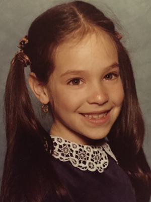

 {.left-img}

Z In Philadelphia, Hallee Adelman was born with a tiny brain and a last name that began with a Z. 

During her early years, Hallee re-envisioned neighborhood games like wire ball and Dungeons & Dragons, traveled to space in her under-the-desk rocket, built snow castles for faraway kingdoms, sewed underpants for stuffed animals, and climbed trees taller than the sun (even after falling into a trash can).   

She spent so much time imagining that she read only selective favorites like The Monstes at the End of This Book, Caps for Sale,  Go, Dog. Go!,  Amelia Bedelia, Sticky Stanley, and some sing-songy goat book with a red, white and black cover.  

As Hallee grew, so did the size of her brain (arguable), her last name, and her diverse book collection.  She fell in love with the Weird School Series, Harry Potter books, One for the Murphys, The Truth About Twinkie Pie, The Fault in Our Stars, The Sky is Everywhere, Crank, The Daughter of Smoke and Bone, Red Queen, and Eleanor & Park. 

## TO {.center}

Mixing her desire to imagine with a quest to explore and share, Hallee became a teacher. She was determined to help unleash the extraordinary talents of her elementary through university students.  Hallee earned a PhD. She chaired events like Please Touch Museum’s Storybook Ball to celebrate story, authors, and families, and served on boards like the Philadelphia School Partnership to advocate for quality education for children and teens. She supported child/teen-focused organizations such as Donors Choose, Franklin Institute, CHOP, Simon’s Fund, the West Philadelphia Alliance for Children, and the Girl Scouts.

 {.right-img}

Through all of her efforts, Hallee’s goal has been for all children and teens to have opportunities to imagine boundlessly, unlock their strengths, and discover their passions. Hallee creates writing and multimedia projects for children and teens.  

Currently, Hallee is writing zany picture books and a teen novel, Frayed, about twins in the worlds of fashion and addiction in search of beauty in an imperfect world.   
She is also developing www.doyouha.com, a children’s property that encourages creativity, social emotional learning, and laughter. 

Hallee has two amazing daughters and a mohawked dog named Romeo. Thanks to her awesome husband, her married name will place her work on the first shelf in the bookstore.		

A

