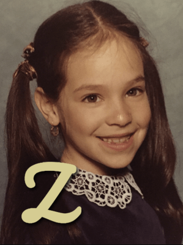

{.left-img}

In Philadelphia, Hallee Adelman was born with a teeny brain and a last name that began with a Z.  

During her early years, Hallee re-envisioned neighborhood games like wire ball and Dungeons & Dragons, traveled to space in her under-the-desk rocket, built snow castles for faraway kingdoms, sewed underpants for stuffed animals, and climbed trees taller than the sun (even after falling into a trash can).   

She spent so much time imagining that only read selective favorites like _The Monster at the End of This Book_, _Caps for Sale_,  _Go, Dog. Go!_,  _Amelia Bedelia_, _Sticky Stanley_, and some sing-songy goat book with a red, white and black cover.  

As Hallee grew, so did the size of her brain (arguable), her last name, and her diverse book collection. She fell in love with _The Dot_, the _Weird School_ Series, _Harry Potter_ books, _One for the Murphys_, _The Truth About Twinkie Pie_, _The Fault in Our Stars_, _The Sky is Everywhere_, _Crank_, _The Daughter of Smoke and Bone_, _Red Queen_, and _Eleanor & Park_.  

{.center}

Mixing her desire to imagine with a quest to explore and share, Hallee became a teacher. She was determined to unleash the extraordinary talents of her elementary through university students.  Hallee earned a PhD. She also chaired events like Please Touch Museum’s Storybook Ball to celebrate story, authors, and families. Adelman served on boards like the Philadelphia School Partnership to advocate for quality education for children and teens. She has supported child/teen-focused organizations such as Donors Choose, Franklin Institute, CHOP, Simon’s Fund, the West Philadelphia Alliance for Children, and the Girl Scouts.

Through all of her efforts, Hallee’s goal has been for all children and teens to have opportunities to imagine boundlessly, unlock their strengths and discover their passions. 

{.right-img}

Currently, Hallee is writing zany picture books and a teen novel, _Frayed_, about twins in the worlds of fashion and addiction who search for beauty in an imperfect world.   

She is also developing [www.doyouha.com](http://doyouha.com), a children’s property that encourages creativity, social emotional learning, and laughter. 

Hallee has two amazing daughters and a mohawked dog named Romeo. Thanks to her awesome husband, her married name will place her work on the first shelf in the bookstore.		

