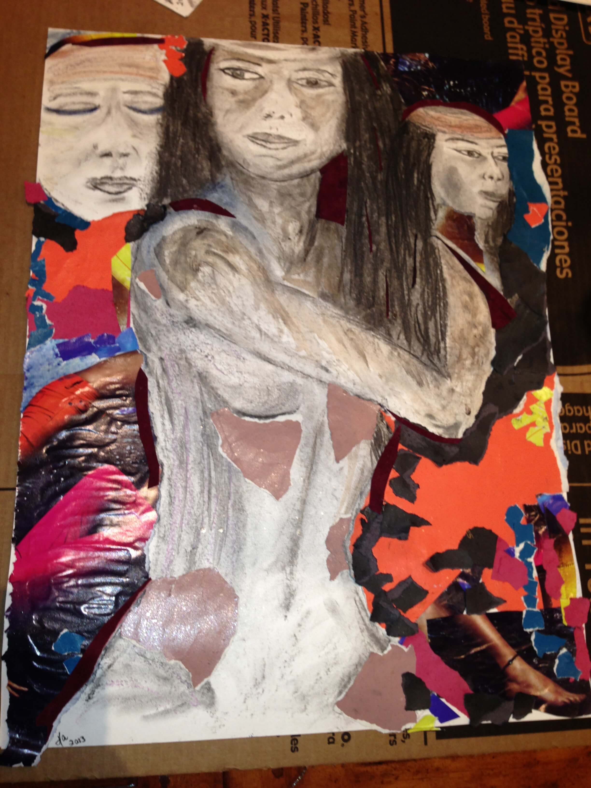
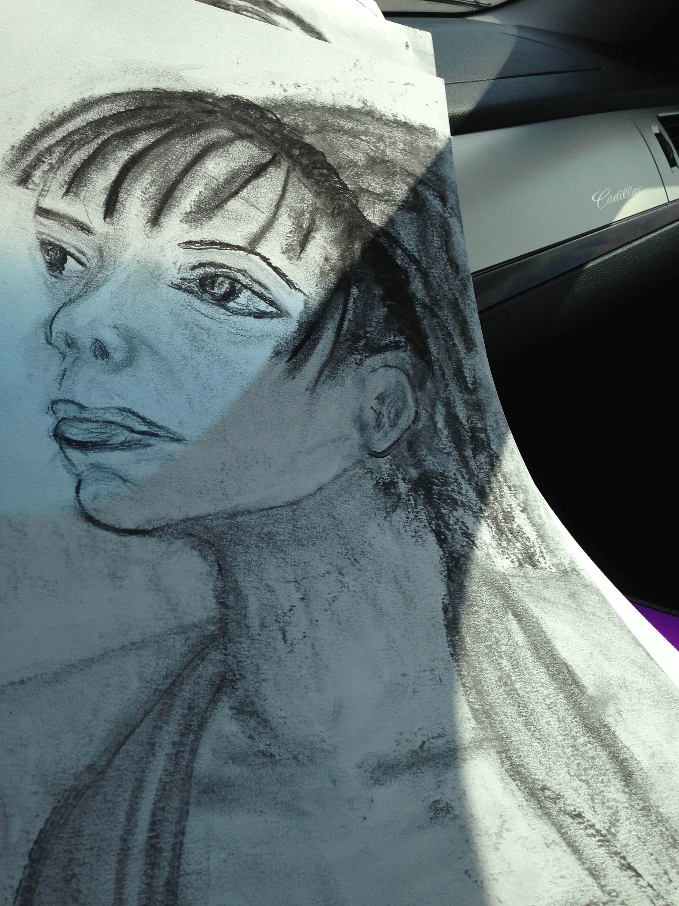
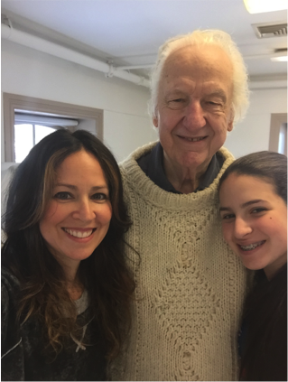
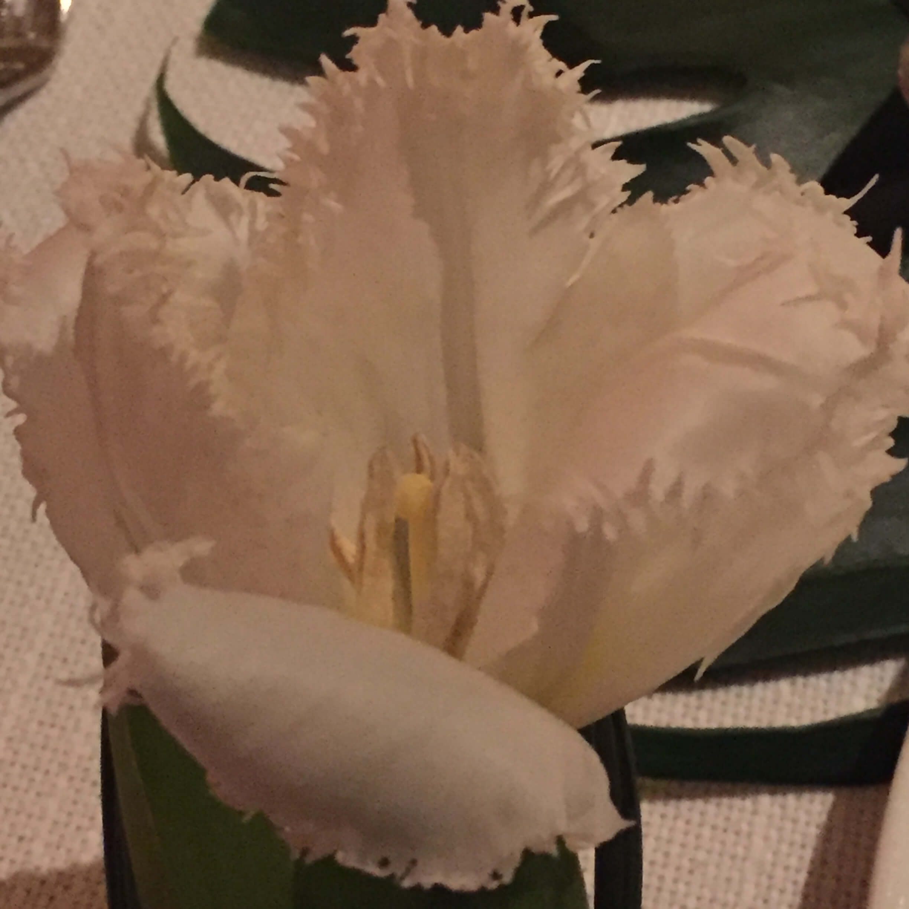
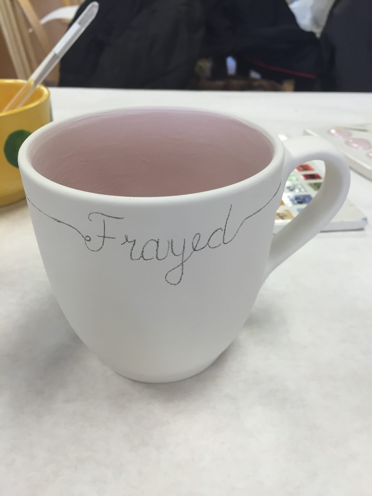
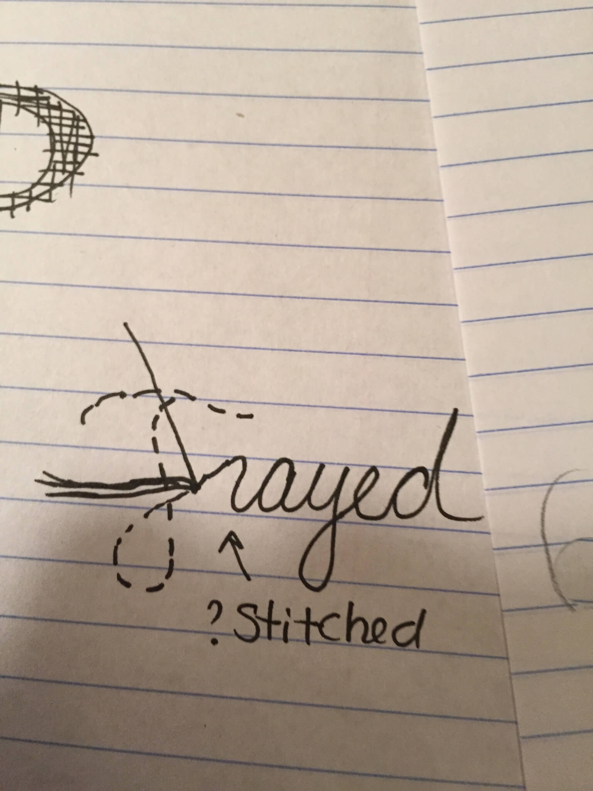
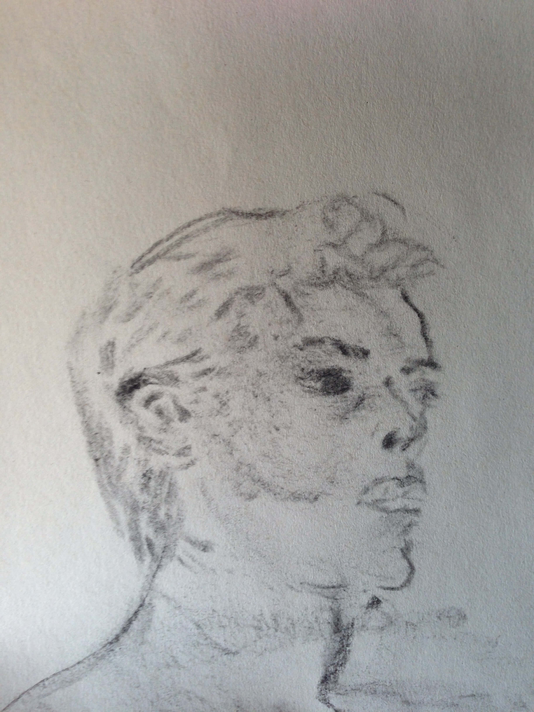
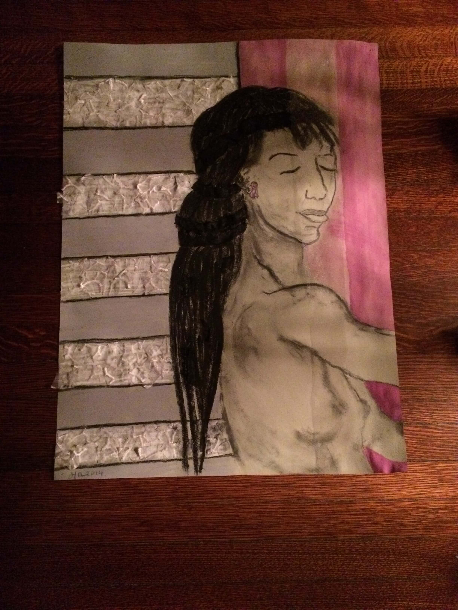
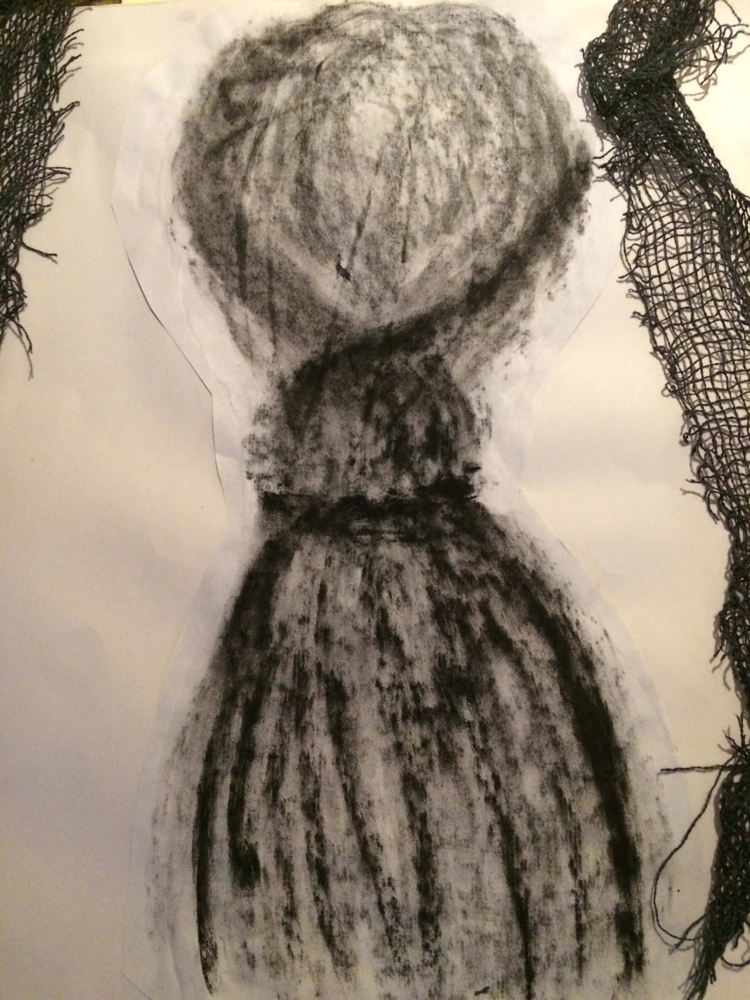

# Art Fuels Art

When I develop characters or prepare to revise a manuscript, I often stop writing and turn to other forms of art.  I’ve found that switching arts helps me either dig deeper on the “feelings level” or stay connected to my story. 

While crafting characters for my recent teen novel, Frayed, I signed up for a local drawing class. I’m not an artist, so there was no pressure to create “good work.” For me, this was key. It allowed me to simply explore. When models or still-life were presented, I focused on feelings, and I drew.  Here are some of my pieces and what they represent: 

 
Using fashion magazines and charcoal, this piece helped me think through my main character: her pain, her fear, and ultimately her strength.   

 
This drawing allowed me to channel Milo, a character suffering from addiction. I used a heavy hand to represent her intensity and drew the crumbled bags to show how she felt on the inside. 

 
 
This charcoal drawing brought to life one of the characters telling her story in an Al-Anon meeting that my main character attends. 
 

This piece represents my main character’s mentor. I wanted to show the point when the mentor couldn’t continue to go with Hope on her journey. I used pastels and charcoal. 

As authors, we hold so much our heads about our stories. When I knew I needed to step away to revise Frayed, I still wanted to stay connected to the project and scenes. I focused on music. I began a “Fraylist” or playlist that could represent the events or emotions in my chapter or become theme songs for my characters.  For example, I chose “BREATHE ME” by Sia for one scene where Milo admits that she’s been relapsing. Listening back to the playlist gives me an emotional starting point when I return to the story. 

During my last break from my draft, I went one step further. I wrote my own song lyrics and music to capture the pain of watching someone struggle from addiction. The song is called Round and Round. I even recorded a demo with the help two musicians that I know. I will be posting the demo and more about this experience in another post. 

Unpressured art experiences provide a vulnerability that help to deepen a story. Whether it’s drawing, song writing, photographing, pottery painting, or set building, I’ve found that writing can be fueled and enhanced by engaging in all forms of art. 

**Special thanks: 
To my amazing art teacher**

**These awesome instrumentalist**

**Other art I created for this novel **

 {.item}
 {.item}
 {.item}
 {.item}
 {.item}
 {.item}

